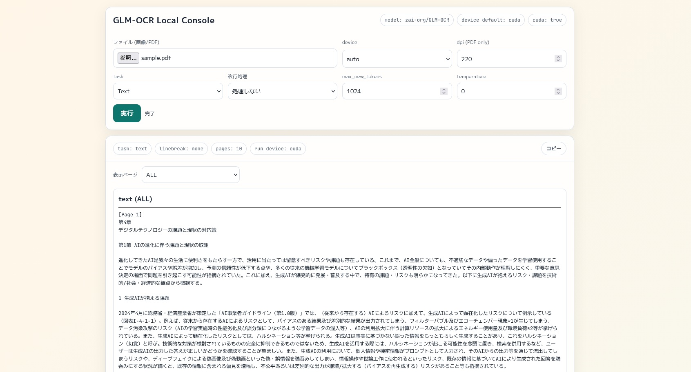

# GLM-OCR Server

`zai-org/GLM-OCR` を使ったローカルOCRサーバーです。  
FastAPI + シンプルなWeb UIで、画像/PDFをページ単位でOCRできます。



## 主な機能

- GLM-OCR推論（`text` / `table` / `formula` / `extract_json`）
- PDF入力（`pypdfium2` でページを画像化してOCR）
- 進捗表示（`事前処理中` -> `i/nページをOCR中`）
- 実行中断（中断API + UIボタン）
- 改行後処理モード（`none` / `paragraph` / `compact`）
- ページ表示切替（ドロップダウン + `ALL`合算表示）
- 表示中結果のコピー（`raw` はコピー対象外）
- モデル/キャッシュはプロジェクト配下に保存

## 動作環境

- Python 3.10+
- Windows または Linux/macOS
- CUDA使用時は対応GPU + ドライバ

## クイックスタート

### Windows

```bat
run.bat
```

### Linux / macOS

```bash
chmod +x run.sh
./run.sh
```

起動後:

- UI: `http://localhost:8000/`
- API Docs: `http://localhost:8000/docs`

## `.env` で設定

プロジェクト直下に `.env` を置くと、`run.sh` / `run.bat` 起動時に読み込みます。

例:

```env
HOST=0.0.0.0
PORT=9000
TORCH_CHANNEL=cu126
```

主な設定値:

- `HOST`: バインドアドレス（既定 `0.0.0.0`）
- `PORT`: 起動ポート（既定 `8000`）
- `TORCH_CHANNEL`: PyTorch配布チャネル（例 `cu126`, `cpu`）

## モデル保存先

モデルキャッシュはプロジェクト内に保存されます。

- `models/hf_cache`
- `models/hf_home`

環境変数 `GLM_MODEL_CACHE` で明示可能です。

## API

### `GET /api/status`

CUDA可否やモデルID、キャッシュディレクトリを返します。

### `POST /api/analyze`

マルチパートフォームでOCR実行。

フォーム項目:

- `file` (required): 画像/PDF
- `device`: `auto` / `cuda` / `cpu`
- `dpi`: PDFレンダリングDPI
- `task`: `text` / `table` / `formula` / `extract_json`
- `linebreak_mode`: `none` / `paragraph` / `compact`
- `schema`: `task=extract_json` のとき必須
- `max_new_tokens`
- `temperature`
- `request_id`（任意。未指定時は自動採番）

### `GET /api/progress/{request_id}`

進捗状態を取得します。

### `POST /api/cancel/{request_id}`

中断要求を送信します。  
生成中はトークン生成ステップ単位で停止判定します。

## ライセンス

- このプロジェクト: `LICENSE`（MIT）
- サードパーティ情報: `THIRD_PARTY_NOTICES.md`
